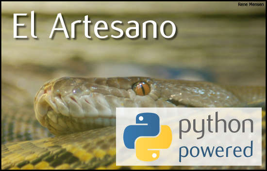

# Proyecto de Programación Computacional

## Introducción

La simulación por computador es un campo de las ciencias de la computación que se enfoca en el modelado e implementación de procesos y sistemas basados en fenómenos del mundo real natural y artificial.  En un principio la función de la simulación se encuentra vinculada al campo de las ciencias exactas y las ciencias sociales, como herramientas de proyección y entrenamiento. Pero recientemente la proliferación y simplificación de herramientas de simulación han permitido que campos disciplinares como la arquitectura, el diseño y las artes incorporen estos procedimientos como parte de sus procesos creativos y de producción. Este taller busca proveer a los participantes herramientas conceptuales y técnicas que les permitan incorporar procesos de simulación en sus propios proyectos en investigación.

## Metodología

El taller se desarrolla con una metodología teórico - práctica, con mayor prioridad a los contenidos prácticos.  Las sesiones consistirarn en cortas introducciones teóricas al tema, seguido de ejercicios de simulación desarrollados en el entorno de programación processing ( http://processing.org ). Los recursos y materiales del taller serán compartidos con los participantes a través de un repositorio de código y archivos, que permanecerá online aún después del taller.

## Prerrequisitos

Para avanzar rápidamente en el tema, es necesario realizar el tutorial introductorio a processing antes de iniciar el taller:

http://hello.processing.org/

##Contenidos

###Sesión 1
Introducción a la programación, Introducción a la simulación:  movimiento simple y vectores.

### Sesión 2
Creación de clases. movimiento fuerzas, aceleración angular.

### Sesión 3
Sistemas de partículas.

### Sesión 4
Dinámicas emergentes: agentes autónomos.

##Bibliografía y recursos online

* Processing: http://processing.org

* Tutorial introductorio a processing: http://hello.processing.org/

* Shiffman, Daniel. Nature of Code ( online: http://natureofcode.com/ )

* Reas, Casey {Software} Structures. Whitney Artport commissions. 2004. Recuperado de http://artport.whitney.org/commissions/softwarestructures/text.html

* Bohnacker, Hartmut. Generative Gestaltung: Entwerfen, Programmieren, Visualisieren. 1. Aufl. ed. Mainz: Schmidt, 2009. ( website: http://generative-gestaltung.de ).

* De Landa, Manuel. Philosophy and Simulation: The Emergence of Synthetic Reason. London: Continuum, 2011.
